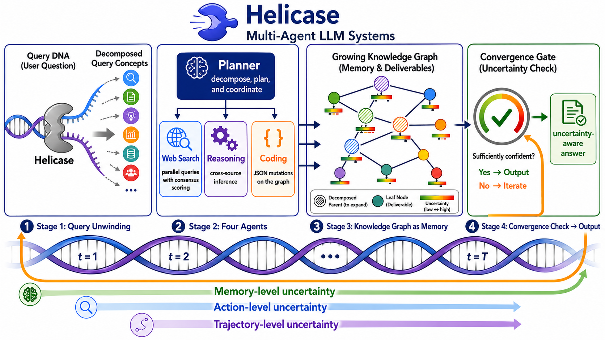
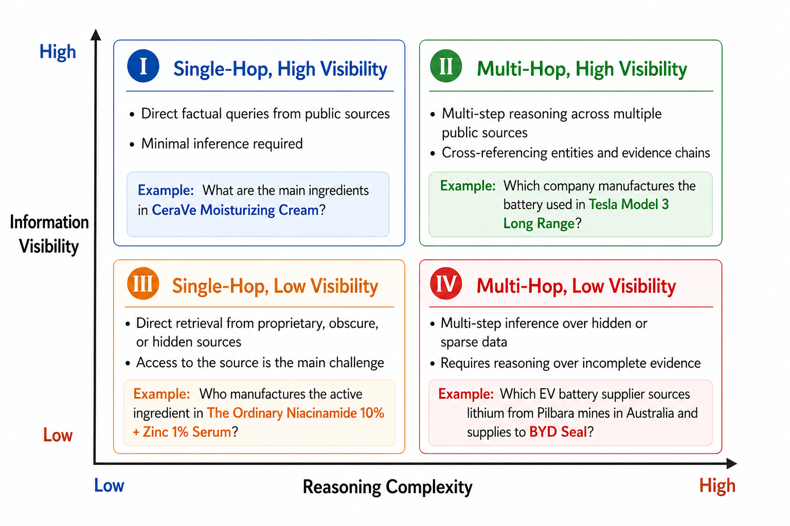
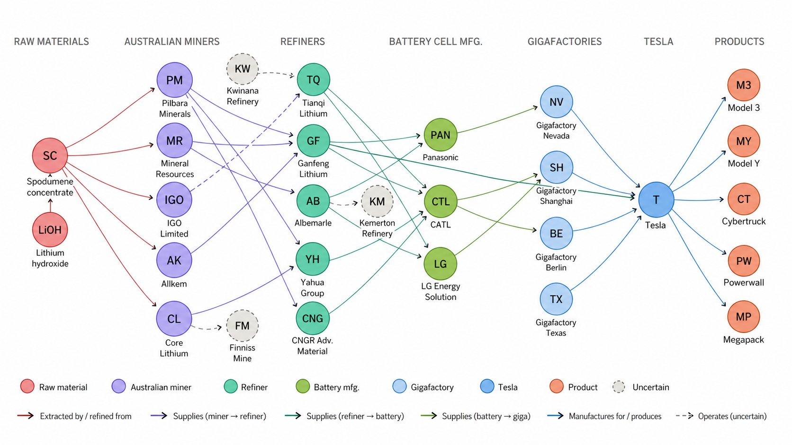

# Helicase

**Uncertainty-Guided Supply Chain Knowledge Graph Construction with Autonomous Multi-Agent LLMs**

> An agentic LLM multi-agent system that autonomously builds query-specific supply chain knowledge graphs from public web sources, with calibrated per-fact uncertainty scores.

[](paper/Helicase_preprint.pdf)
[](https://humanlong-supplychain-deepresearch.hf.space/)
[](#license)
[](#license)

---

## Try the live demo

A hosted instance of the Helicase framework is available for interactive exploration of supply-chain queries:

**Demo URL:** [https://humanlong-supplychain-deepresearch.hf.space/](https://humanlong-supplychain-deepresearch.hf.space/)

Type any supply-chain question (e.g., *"Which Tesla components use lithium from Australian mines?"*) and watch the agent decompose the query, search heterogeneous sources, and assemble a knowledge graph with per-fact uncertainty annotations.

---

## Paper

The full preprint is available in this repository:

- **[Helicase\_preprint.pdf](paper/Helicase_preprint.pdf)** — full manuscript, currently under review
- **[main.tex](paper/main.tex)** — LaTeX source (ICLR style)
- **[references.bib](paper/references.bib)** — bibliography

**Status:** Preprint, under review. Not yet peer-reviewed; please cite the preprint accordingly.

### Citation

```bibtex
@misc{long2026helicase,
  title         = {Helicase: Uncertainty-Guided Supply Chain Knowledge Graph
                   Construction with Autonomous Multi-Agent LLMs},
  author        = {Long, Yunbo and Zhao, Haolang and Zheng, Ge and Brintrup, Alexandra},
  year          = {2026},
  note          = {Preprint, under review.},
  howpublished  = {\url{https://humanlong-supplychain-deepresearch.hf.space/}}
}
```

---

## Framework overview

Helicase addresses two long-standing limitations of LLM-based supply-chain analytics:

1. **Structural inference under information fragmentation** — many supply-chain questions have no answer in any single document. The answer must be synthesised by traversing multi-hop dependencies across heterogeneous, low-visibility web sources.
2. **Calibrated uncertainty for managerial decisions** — narrative answers from frontier LLMs cannot be acted on without per-fact confidence estimates that reflect source reliability and cross-source consistency.

### Architecture



The system runs a **helical loop** of four specialised agents:

| Agent | Responsibility |
|---|---|
| **Planner** | Decomposes the user query into an action set; at every iteration, generates new actions targeted at high-uncertainty regions of the current knowledge graph. |
| **Web Search Agent** | Performs multi-query, multi-source evidence retrieval and extraction from HTML, PDF, tabular, and social-platform sources. |
| **Reasoning Agent** | Synthesises harvested evidence, performs cross-source inference, and identifies which structural updates the new findings warrant. |
| **Coding Agent** | Translates these decisions into deterministic, auditable JSON mutations on the knowledge graph (create, merge, revise nodes and edges) with fuzzy entity matching to prevent duplicates. |

### Three-layer uncertainty quantification

| Layer | Captures |
|---|---|
| **Action layer** | Reliability of each individual agent execution (LLM-based factual consensus across parallel web queries). |
| **Trajectory layer** | Whether the system is still discovering new information or repeating prior investigations. |
| **Memory layer** | A graph-wide confidence measure consolidating all per-fact uncertainties via multiplicative accumulation, used as the convergence signal. |

### Convergence by uncertainty stagnation

Iteration terminates when memory-layer uncertainty exhibits sustained stagnation across several consecutive iterations, indicating that further search is unlikely to reduce uncertainty.

---

## Benchmark: Supply Chain Query Assessment (SCQA)

We release **SCQA**, the first benchmark designed for agentic supply-chain discovery:

- **80 supply-chain queries** spanning personal care, food and beverages, and electronics/automotive
- **4 quadrants** combining two orthogonal dimensions: reasoning complexity (single-hop vs multi-hop) × information visibility (high vs low)
- Human-verified ground-truth answers; for the hardest quadrant (Q4), additional entity–relationship ground-truth graphs



### Headline results

| System | Q1 Acc | Q2 F1 | Q3 Acc | Q4 Graph F1 | UCE |
|---|---|---|---|---|---|
| Claude Opus 4.6 | 0.80 | 0.55 | 0.55 | 0.63 | — |
| GLM-5 | 0.60 | 0.40 | 0.20 | 0.33 | — |
| DeepSeek-V3.2 | 0.40 | 0.48 | 0.15 | 0.27 | — |
| Qwen3-235B | 0.30 | 0.44 | 0.05 | 0.25 | — |
| ReAct (Qwen3-235B) | 0.60 | 0.39 | 0.45 | 0.32 | — |
| ToT (Qwen3-235B) | 0.55 | 0.30 | 0.35 | 0.39 | — |
| **Helicase** | **0.95** | **0.85** | **1.00** | **0.85** | **0.25** |

Helicase is the only system that produces calibrated uncertainty estimates (UCE = 0.25 vs. uncalibrated for all baselines).

### Representative query trace



For *"Which Tesla components use lithium from Australian mines?"*, Helicase converged in five helical iterations and constructed a seven-tier supply-chain knowledge graph with 28 nodes and 45 edges, while baseline systems recovered only partial fragments.

---

## Code availability

The Helicase reference implementation is licensed under **Apache 2.0**. Because the codebase is not currently distributed under a permissive MIT-style licence, **we do not publish the source in this repository.** The hosted demo (link above) lets external researchers inspect the system's behaviour end-to-end without source access.

### Requesting source access

Researchers, students, and collaborators interested in the source code, evaluation scripts, the SCQA benchmark data, or extending the framework are warmly invited to get in touch.

> **Contact (corresponding author):**
> **Yunbo Long** — Department of Engineering, University of Cambridge
> Email: **yl892@cam.ac.uk**

Please briefly describe your intended use (academic research, reproducibility study, derivative work, commercial pilot, etc.) so the right materials can be shared under the appropriate terms.

---

## Authors

- **Yunbo Long** (Corresponding author) — Department of Engineering, University of Cambridge — yl892@cam.ac.uk
- Haolang Zhao — Department of Engineering, University of Cambridge
- Ge Zheng — Department of Engineering, University of Cambridge
- Alexandra Brintrup — Department of Engineering, University of Cambridge & The Alan Turing Institute

---

## License

- **Paper text and figures (this repository):** Creative Commons Attribution 4.0 International (CC-BY-4.0)
- **Helicase source code (held privately):** Apache License, Version 2.0 — source distribution by request only; see [Requesting source access](#requesting-source-access).

---

## Acknowledgements

We thank the open-source community whose tools and models made Helicase possible, and the supply-chain practitioners who provided domain feedback during benchmark construction.
